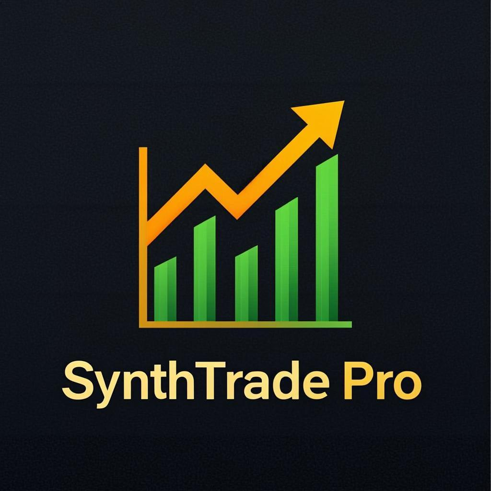

# SynthTrade Pro

> Trading Bot Profesional para Indices Sinteticos de Deriv

**Desarrollado por [A2K DIGITAL STUDIO](#)**



---

## Descripcion

SynthTrade Pro es un bot de trading automatizado diseñado para operar en los indices sinteticos de Deriv. Incluye estrategias avanzadas de analisis tecnico, gestion de riesgo integrada y una interfaz profesional para monitorear y ejecutar trades en tiempo real.

### Mercados Soportados

| Categoria | Mercados |
|-----------|----------|
| **Boom/Crash** | Boom 300, 500, 1000 / Crash 300, 500, 1000 (Digit Contracts) |
| **Volatility** | Vol 10, 25, 50, 75, 100 / Vol 1s (10, 25, 50, 75, 100) |
| **Jump** | Jump 10, 25, 50, 75, 100 |
| **Step** | Step RNG |
| **Metales** | Gold/USD, Silver/USD, Gold/JPY, Gold/EUR, Silver/JPY, Silver/EUR |
| **Forex** | EUR/USD, GBP/USD, USD/JPY, AUD/USD, USD/CAD, EUR/GBP, GBP/JPY |

### Estrategias Incluidas

- **RSI** — Sobrecomprado/Vendido con reversión
- **MA Crossover** — Cruce de medias móviles (Golden/Death Cross)
- **Bollinger Bands** — Rebote en bandas superior/inferior
- **Spike Detection** — Detección de picos de precio

### Funcionalidades

- Auto-trading con señales compuestas de múltiples estrategias
- Gestión de riesgo: perdida máxima diaria, objetivo de profit, máximo de trades
- Sistema Martingale opcional
- Monitoreo en tiempo real de positions abiertas
- Historial de trades con estadísticas de rendimiento
- Atajos de teclado (B=CALL, S=PUT, Espacio=Auto)
- Sonidos de notificación para trades, wins y losses

---

## Requisitos

- **Node.js 18+** o **Bun** (recomendado)
- Una cuenta de **Deriv** (demo o real)
- Token API de Deriv con permisos de **Trade** y **Payments**

---

## Instalacion Local

### Opcion 1: Con el instalador (Windows)

1. Descarga y extrae el proyecto
2. Ejecuta **`INICIAR-BOT.bat`**
3. Abre `http://localhost:3000` en tu navegador

### Opcion 2: Manual

```bash
# 1. Instalar dependencias
bun install
# o si usas npm:
npm install

# 2. Iniciar el servidor
bun run dev
# o con npm:
npm run dev

# 3. Abrir en el navegador
# http://localhost:3000
```

---

## Configuracion

### Obtener tu Token API de Deriv

1. Crea una cuenta en [deriv.com](https://app.deriv.com)
2. Ve a **Settings > API Token**
3. Crea un nuevo token con estos permisos:
   - **Trade** (comprar/vender contratos)
   - **Payments** (ver balance)
   - **Admin** (gestion de cuenta)
4. Copia el token y pegalo en la pantalla de conexion del bot

> **IMPORTANTE**: Usa una cuenta DEMO para probar. El bot funciona igual con demo que con real.

---

## Despliegue en Firebase Hosting

### Requisitos previos

- Tener [Firebase CLI](https://firebase.google.com/docs/cli) instalado
- Tener un proyecto creado en [Firebase Console](https://console.firebase.google.com)

### Pasos

```bash
# 1. Iniciar sesion en Firebase
firebase login

# 2. Inicializar el proyecto (solo la primera vez)
firebase init hosting
# Selecciona tu proyecto de Firebase
# Public directory: out
# Single-page app: Yes
# Overwrite index.html: No

# 3. Construir el proyecto para produccion
bun run build

# 4. Desplegar a Firebase
firebase deploy --only hosting
```

### Importante: Cambiar el Project ID

Abre `.firebaserc` y reemplaza `TU-PROJECT-ID-AQUI` con el ID real de tu proyecto de Firebase:

```json
{
  "projects": {
    "default": "TU-PROJECT-ID-AQUI"
  }
}
```

---

## Despliegue en GitHub

```bash
# 1. Iniciar repositorio
git init
git add .
git commit -m "SynthTrade Pro v1.0 - A2K DIGITAL STUDIO"

# 2. Crear repositorio en GitHub y conectar
git remote add origin https://github.com/TU-USUARIO/SynthTradePro.git
git branch -M main
git push -u origin main
```

---

## Estructura del Proyecto

```
SynthTradePro/
├── public/                 # Archivos estaticos
│   ├── logo-a2k.jpeg       # Logo A2K Digital Studio
│   └── trading-bot-logo.png
├── src/
│   ├── app/                # Paginas (Next.js App Router)
│   │   ├── layout.tsx      # Layout principal
│   │   └── page.tsx        # Dashboard principal
│   ├── components/         # Componentes React
│   │   ├── connection-panel.tsx   # Panel de conexion API
│   │   ├── market-selector.tsx    # Selector de mercados
│   │   ├── trading-controls.tsx   # Controles de trading
│   │   ├── price-chart.tsx        # Grafico de precios
│   │   ├── open-positions.tsx     # Positions abiertas
│   │   ├── trade-history.tsx      # Historial de trades
│   │   ├── strategy-panel.tsx     # Panel de estrategias
│   │   ├── risk-management.tsx    # Gestion de riesgo
│   │   ├── performance-stats.tsx  # Estadisticas
│   │   └── activity-log.tsx       # Log de actividad
│   └── lib/                # Logica del negocio
│       ├── deriv-api.ts    # Cliente WebSocket Deriv
│       ├── store.ts        # Estado global (Zustand)
│       └── strategies.ts   # Motor de estrategias
├── firebase.json           # Config Firebase Hosting
├── .firebaserc             # Project ID de Firebase
├── next.config.ts          # Config Next.js
├── package.json            # Dependencias
├── INICIAR-BOT.bat         # Script de inicio (Windows)
└── .gitignore              # Archivos ignorados
```

---

## Atajos de Teclado

| Tecla | Accion |
|-------|--------|
| `B` | Comprar CALL |
| `S` | Comprar PUT |
| `Espacio` | Activar/Desactivar Auto-Trading |

---

## Notas Importantes

- **NUNCA** compartas tu token API de Deriv
- **SIEMPRE** prueba primero con cuenta DEMO
- El trading conlleva riesgo. Solo opera con dinero que puedas permitirte perder
- Boom/Crash usan contratos DIGIT (DIGITMATCH/DIGITDIFF), no CALL/PUT directo
- Gold y metales tienen duracion minima de 1 hora

---

## Tecnologias

- **Next.js 16** — Framework React
- **TypeScript** — Tipado seguro
- **Tailwind CSS** — Estilos
- **shadcn/ui** — Componentes de UI
- **Zustand** — Manejo de estado
- **Deriv WebSocket API** — Conexion a mercados

---

## Licencia

Este software es propiedad de **A2K DIGITAL STUDIO**. Queda prohibida su redistribucion, copia o venta sin autorizacion expresa del autor.

(c) 2026 A2K DIGITAL STUDIO. Todos los derechos reservados.
